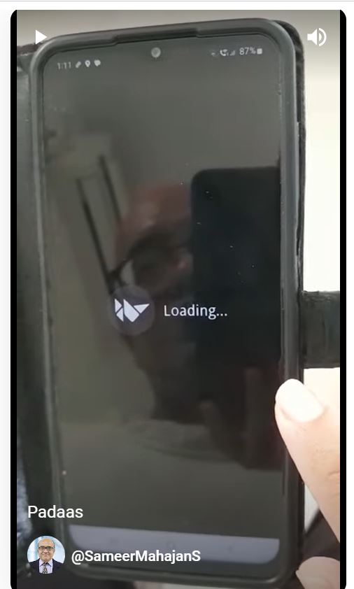

# Paadas
Reciting tables of numbers 1 to 10 in marathi (called Paadas in marathi). This is a kivy app and works on Android. Checkout the Actions. You can download the built APK artefact and try it out on your mobile.

